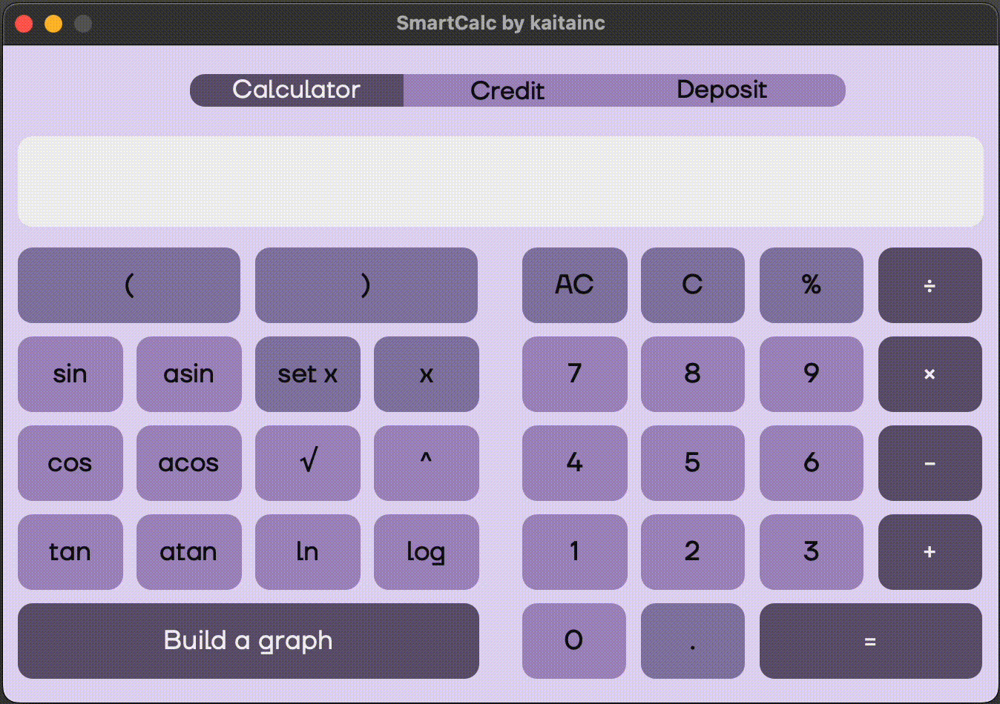
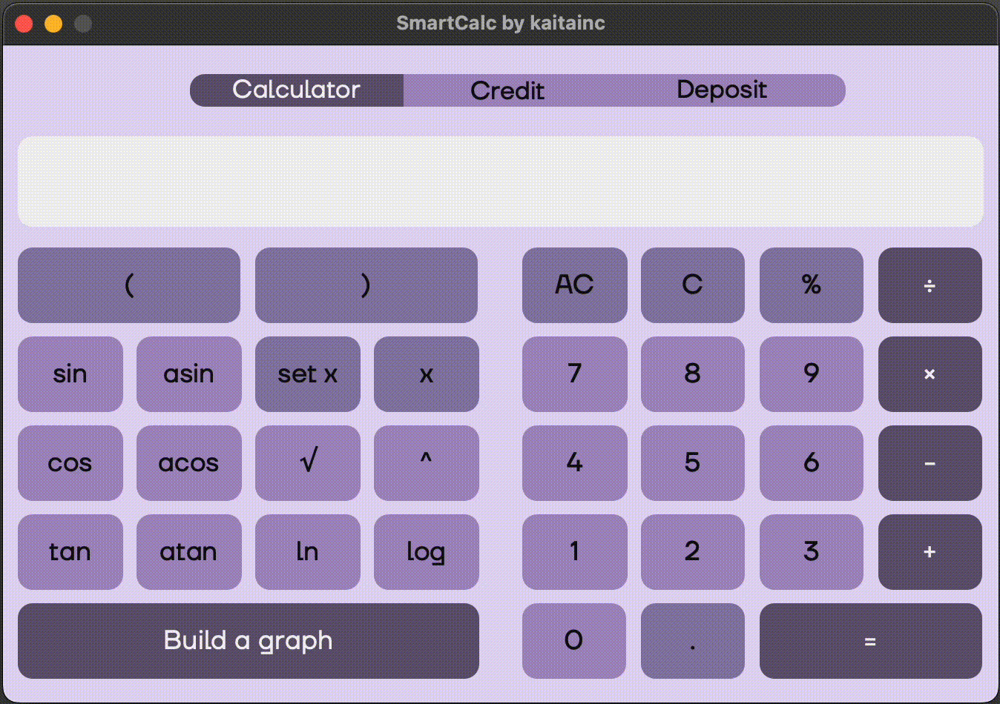
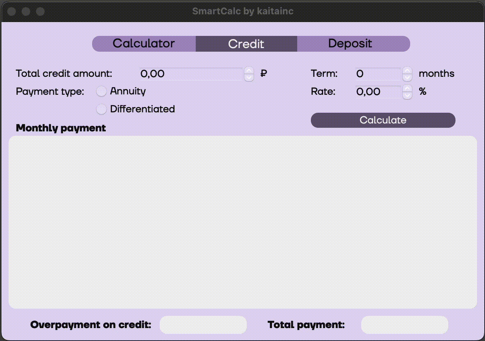

# Описание 

В калькуляторе реализована расширенная версия обычного калькулятора, который можно найти в стандартных приложениях каждой операционной системы - для этого использован язык программирования С и структурный подход. Помимо базовых арифметических операций, как плюс-минус и умножить-поделить, калькулятор дополнен возможностью вычисления арифметических выражений с учетом приоритетов, а также некоторыми математическими функциями (синус, косинус, логарифм и т.д.). Помимо вычисления выражений калькулятор поддерживает использование переменной _x_ и построение графика соответствующей функции. В качестве дополнительных улучшений представлены кредитный и депозитный калькулятор.

## Особенности

- Простой интерфейс и красивый фиолетовый цвет
- Поддержка базовых арифметических операций
- Отображение результатов вычислений
- Вычисление без необходимости вводить знак умножения между числом и скобкой, числом и переменной X, числом и функцией

## Использование стандартного калькулятора

1. Введите числа и операторы, используя кнопки на интерфейсе калькулятора
2. Нажмите кнопку "=" для получения результата вычислений
3. Отображение результата появится на экране калькулятора
  
  

## Построение графиков
1. Введите выражение с переменной X
2. Нажмите на кнопку "Build a graph"
3. Введите область определения и область значений
4. Нажмите на кнопку "Build a graph"
  
  

## Расчет платежей по кредиту
1. Введите параметры кредита, а также укажите тип платежей
2. Нажмите на кнопку "Calcuate"
  
  

## Расчет депозита
1. Введите параметры кредита
2. Введите месяц и сумму пополнения, если необходимо
3. Введите месяц и сумму снятия, если необходимо
4. Для очистки таблицы нажмите "Clear table"
5. Отметите капитализацию, если необходимо
6. Нажмите на кнопку "Calcuate"
  
  